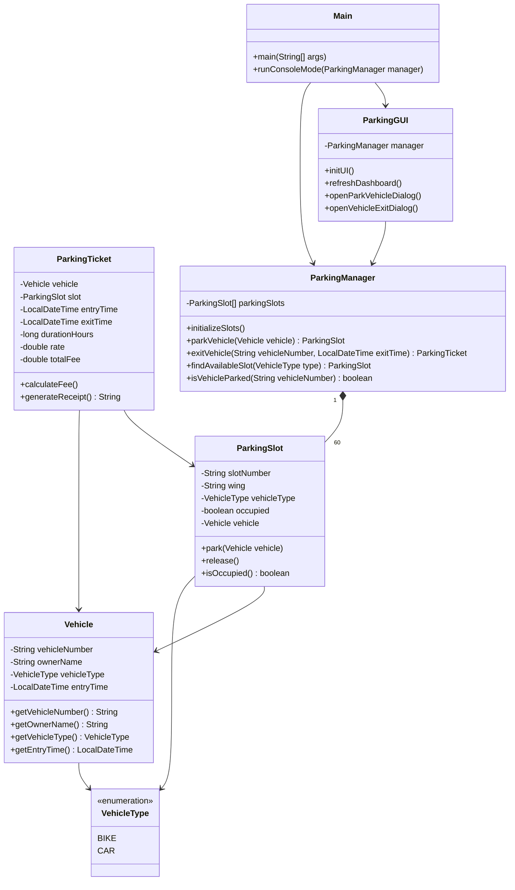

# 🚗 Parking Management System (Java)

A robust, feature-rich Java application designed to automate vehicle parking operations in multi-wing facilities. Built with object-oriented design principles, the application features dual operational modes—a modern **Java Swing Graphical User Interface (GUI)** and a **Terminal Command Line Interface (Console)**—operating synchronously with real-time state updates.

---

## 📋 Table of Contents

- [Overview](#-overview)
- [Key Features](#-key-features)
- [Project Architecture & Design](#-project-architecture--design)
- [Parking Lot Layout & Capacity](#-parking-lot-layout--capacity)
- [Fee Structure & Billing Policy](#-fee-structure--billing-policy)
- [Prerequisites](#-prerequisites)
- [Building & Running the Application](#-building--running-the-application)
- [Usage Guide](#-usage-guide)
  - [Swing GUI Mode](#1-swing-gui-mode)
  - [Console Mode](#2-console-mode)
- [Sample Parking Receipt](#-sample-parking-receipt)
- [Project Directory Structure](#-project-directory-structure)
- [Error Handling & Validations](#-error-handling--validations)

---

## 🔍 Overview

The **Parking Management System** addresses parking facility operations by organizing parking slots across multiple wings (`Wing A`, `Wing B`, `Wing C`) and categorizing vehicles into distinct types (`BIKE` for 2-Wheelers and `CAR` for 4-Wheelers). 

It automates slot allocation upon vehicle entry, enforces strict validation (e.g., preventing duplicate entries or type mismatches), calculates billable hours and fees upon exit, and generates formatted receipts.

---

## 🌟 Key Features

- **Dual Concurrent Interfaces**:
  - **Swing GUI**: Visual interactive dashboard with live color-coded slot grids, statistical cards, and interactive modal dialogs.
  - **Console Menu**: Full-featured CLI for terminal lovers, with instant synchronization to the GUI dashboard.
- **Multi-Wing Architecture**: Supports 3 distinct wings (`Wing A`, `Wing B`, `Wing C`), each housing designated 2-Wheeler and 4-Wheeler slots.
- **Automated Slot Allocation**: Smart allocation algorithm assigns the first available slot matching the vehicle type across wings.
- **Dynamic Fee Calculation**: Automated billing based on vehicle classification and duration rounded up to billable hours.
- **Time Simulation Engine**: Supports simulated exit times (e.g. 30 mins, 1 hr 10 mins, 2 hrs 20 mins, 5 hrs, 24 hrs) for quick testing of billing logic without manual waiting.
- **Interactive Visual Slot Grid**: Click any slot in the GUI to view detailed occupant info or initiate instant parking for available slots.
- **Robust Validations**: Comprehensive input sanitization, uppercase vehicle registration normalization, duplicate entry protection, and descriptive exception handling.

---

## 🏗️ Project Architecture & Design

The application adheres to clean Object-Oriented Programming (OOP) principles, separating domain models, business management logic, and presentation layers.



### Class Responsibilities

| Class Name | Type | Description |
| :--- | :--- | :--- |
| [`VehicleType`](file:///Users/ajitsingh/Desktop/Projects/CaseStudy/ParkingManagement%28Java%29/VehicleType.java) | Enum | Defines supported vehicle categories: `BIKE` (2-Wheeler) and `CAR` (4-Wheeler). |
| [`Vehicle`](file:///Users/ajitsingh/Desktop/Projects/CaseStudy/ParkingManagement%28Java%29/Vehicle.java) | Model | Represents a vehicle with registration number, owner name, type, and entry timestamp. |
| [`ParkingSlot`](file:///Users/ajitsingh/Desktop/Projects/CaseStudy/ParkingManagement%28Java%29/ParkingSlot.java) | Model | Represents an individual parking space (slot number, wing, vehicle type suitability, occupancy status). |
| [`ParkingTicket`](file:///Users/ajitsingh/Desktop/Projects/CaseStudy/ParkingManagement%28Java%29/ParkingTicket.java) | Model / Service | Computes duration, applies hourly tariff rates, and generates formatted textual receipts. |
| [`ParkingManager`](file:///Users/ajitsingh/Desktop/Projects/CaseStudy/ParkingManagement%28Java%29/ParkingManager.java) | Controller | Core business engine managing 60 slots array, allocation searches, entry/exit workflows, and stats. |
| [`ParkingGUI`](file:///Users/ajitsingh/Desktop/Projects/CaseStudy/ParkingManagement%28Java%29/ParkingGUI.java) | View / GUI | Java Swing presentation layer featuring statistics panels, visual slot matrix, and modal forms. |
| [`Main`](file:///Users/ajitsingh/Desktop/Projects/CaseStudy/ParkingManagement%28Java%29/Main.java) | Entry Point | Boots GUI on Swing Event Dispatch Thread (EDT) and executes interactive CLI loop in terminal. |

---

## 📐 Parking Lot Layout & Capacity

The parking facility comprises **60 Total Slots** distributed evenly across 3 Wings:

| Wing | 2-Wheeler (BIKE) Slots | 4-Wheeler (CAR) Slots | Subtotal | Slot Number Format |
| :--- | :---: | :---: | :---: | :--- |
| **Wing A** | 10 | 10 | 20 | `A-2W-01` to `A-2W-10` / `A-4W-01` to `A-4W-10` |
| **Wing B** | 10 | 10 | 20 | `B-2W-01` to `B-2W-10` / `B-4W-01` to `B-4W-10` |
| **Wing C** | 10 | 10 | 20 | `C-2W-01` to `C-2W-10` / `C-4W-01` to `C-4W-10` |
| **Total** | **30** | **30** | **60 Slots** | |

---

## 💰 Fee Structure & Billing Policy

### Tariff Rates
- 🏍️ **BIKE (2-Wheeler)**: **₹10** per billable hour
- 🚗 **CAR (4-Wheeler)**: **₹20** per billable hour

### Billing Calculation Rules
1. **Minimum Charge**: Any duration up to 60 minutes is billed as **1 Hour**.
2. **Ceiling Rounding**: Fractional hours are rounded up to the next full billable hour.
   - *Example 1*: `30 minutes` duration $\rightarrow$ `1 Billable Hour`
   - *Example 2*: `1 hour 10 minutes` duration $\rightarrow$ `2 Billable Hours`
   - *Example 3*: `2 hours 20 minutes` duration $\rightarrow$ `3 Billable Hours`

---

## 💻 Prerequisites

- **Java Development Kit (JDK)**: Version 8 or higher (JDK 11, 17, or 21 recommended).
- **Operating System**: macOS, Windows, or Linux.
- **GUI Environment**: Display server (X11 / macOS WindowServer / Windows Desktop) for Swing GUI rendering.

To verify your Java installation:
```bash
java -version
javac -version
```

---

## ⚙️ Building & Running the Application

### 1. Compile Source Files
Navigate to the project root directory and compile all Java files:

```bash
cd /Users/ajitsingh/Desktop/Projects/CaseStudy/ParkingManagement(Java)
javac *.java
```

### 2. Run the Application
Launch the application by running the `Main` class:

```bash
java Main
```

*(Upon execution, the Swing GUI window will open automatically, while the interactive Console menu appears in your terminal window).*

---

## 📖 Usage Guide

### 1. Swing GUI Mode

The GUI provides an intuitive dashboard split into three main regions:

1. **Dashboard Statistics Cards (Top)**:
   - **Total Slots**: Total facility capacity (60).
   - **Available Slots**: Count of unassigned slots across all wings (Green indicator).
   - **Occupied Slots**: Count of currently occupied slots (Red indicator).
   - **Wing Summary**: Live breakdown of available vs occupied slots for Wing A, Wing B, and Wing C.

2. **Visual Slots Matrix (Center)**:
   - Grid layout showing all slots grouped by **Wing** and **Vehicle Type**.
   - **Green Slot Buttons**: Slot is Available. Click to launch instant parking dialog pre-filled for that vehicle type.
   - **Red Slot Buttons**: Slot is Occupied (displays Slot ID & Vehicle Number). Click to view full details (Owner name, Entry time, Type).

3. **Action Buttons (Bottom)**:
   - **Park Vehicle**: Opens a dialog to park a vehicle (Input Vehicle No, Owner Name, Vehicle Type).
   - **Vehicle Exit**: Process exit for a vehicle, choose simulated duration, and display ticket receipt.
   - **View Parking Slots**: Display complete tabular view of all 60 slots in a scrollable popup.
   - **View Available Slots**: Shows categorized list of available slots by wing.
   - **Exit**: Close the application.

---

### 2. Console Mode

When launched from a terminal, the console menu presents the following options:

```text
==================================================
       PARKING MANAGEMENT SYSTEM (CONSOLE)        
==================================================

--- CONSOLE MENU ---
1. Park Vehicle
2. Vehicle Exit
3. Display Slots
4. Exit Console Mode
Enter choice (1-4): 
```

- **Option 1 (Park Vehicle)**: Prompts for Vehicle Number (e.g. `MH12AB1234`), Owner Name, and Vehicle Type (`1` for BIKE, `2` for CAR). Automatically assigns the first available slot and confirms allocation.
- **Option 2 (Vehicle Exit)**: Prompts for Vehicle Number and allows optional duration simulation (`0` for Actual Time, `1` for 30m, `2` for 1h 10m, `3` for 2h 20m). Generates receipt and frees up the assigned slot.
- **Option 3 (Display Slots)**: Prints full text list of all 60 slots and their current status (`AVAILABLE` or `OCCUPIED`).
- **Option 4 (Exit Console Mode)**: Closes console prompt loop while leaving GUI running.

---

## 🧾 Sample Parking Receipt

When a vehicle exits the facility, a formatted parking receipt is generated:

```text
--------------------------------------------------
                 PARKING RECEIPT                  
--------------------------------------------------
Vehicle Number       : MH12AB1234
Owner Name           : Ajit Singh
Vehicle Type         : CAR
Wing                 : Wing A
Slot Number          : A-4W-01
Entry Time           : 08-10-2026 03:10:00 PM
Exit Time            : 08-10-2026 04:20:00 PM
Parking Duration     : 2 Hour(s)
Rate                 : ₹20 / hour
--------------------------------------------------
Total Fee            : ₹40
--------------------------------------------------
```

---

## 📁 Project Directory Structure

```text
ParkingManagement(Java)/
│
├── Main.java               # Application entry point & console controller
├── ParkingGUI.java          # Java Swing GUI graphical interface dashboard
├── ParkingManager.java      # Core business logic controller & state manager
├── ParkingSlot.java         # Domain model representing a parking slot
├── ParkingTicket.java       # Billing & receipt generation engine
├── Vehicle.java             # Domain model representing a vehicle
├── VehicleType.java         # Enum defining vehicle categories (BIKE, CAR)
│
├── README.md                # Detailed project documentation
└── *.class                  # Compiled Java bytecode files (generated after javac)
```

---

## 🛡️ Error Handling & Validations

The application implements defensive programming to prevent invalid states:

- **Empty Field Validation**: Rejects empty vehicle numbers or owner names in both GUI and Console.
- **Vehicle Registration Normalization**: Vehicle numbers are trimmed and converted to uppercase automatically (e.g., `mh12ab1234` $\rightarrow$ `MH12AB1234`).
- **Duplicate Parking Protection**: Throws `IllegalArgumentException` if a vehicle with the same registration number is already parked inside.
- **Parking Full Check**: Throws `IllegalStateException` when attempting to park in a category with no remaining slots across all wings.
- **Non-Existent Vehicle Exit**: Throws `IllegalArgumentException` if attempting an exit for a vehicle number not found in the parking lot.

---

## 📄 License & Attribution

Developed as a Java OOP & Swing Case Study project. Feel free to modify and extend for educational or commercial purposes.
